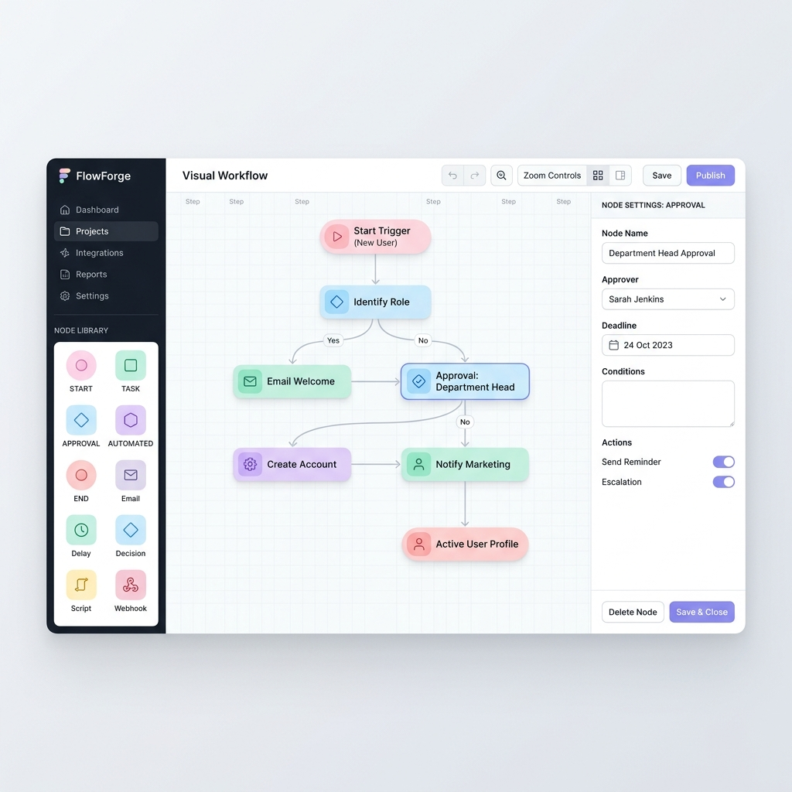

# FlowForge HR - Visual Workflow Designer



A high-performance React application designed for constructing and simulating operational HR workflows. Built with React Flow, this platform emphasizes visual clarity, logical integrity, and extensible architecture.

[](https://reactjs.org/)
[](https://www.typescriptlang.org/)
[](https://tailwindcss.com/)
[](https://reactflow.dev/)
[](https://github.com/pmndrs/zustand)

---

## 🚀 Core Functionality

The current implementation provides a complete end-to-end environment for workflow design:

- **Core Builder**: Fully functional drag-and-drop canvas with automatic edge routing and marker-end support.
- **Node Catalog**: Implemented 5 specialized node types:
  - **Start**: Entry point for every workflow.
  - **Task**: Standard operational unit for HR actions.
  - **Approval**: Decision-making gate with branching capabilities.
  - **Automated**: System-triggered actions for hands-off processing.
  - **End**: Final termination point for the flow.
- **Integrated Simulation**: A dedicated execution hub capable of parsing the workflow graph and simulating step-by-step logic with realistic asynchronous delays.
- **Real-time Validation**: Intelligent feedback system that identifies architectural flaws (e.g., missing Start node, disconnected paths) as changes occur.
- **Premium UI**: 3-panel professional layout with a refined light theme, calibrated pastel palette, and smooth interaction states.

---

## 🛠️ Tech Stack

| Category | Technology |
| :--- | :--- |
| **Framework** | [React 19](https://react.dev/) |
| **Language** | [TypeScript](https://www.typescriptlang.org/) |
| **Flow Engine** | [React Flow](https://reactflow.dev/) |
| **State** | [Zustand](https://zustand-demo.pmnd.rs/) |
| **Styling** | [Tailwind CSS v4](https://tailwindcss.com/) |
| **Icons** | [Lucide React](https://lucide.dev/) |
| **Build Tool** | [Vite](https://vitejs.dev/) |

---

## 🏗️ Architecture

The application is architected for modularity and scalability, leveraging a component-driven approach.

- **Frontend Core**: React 19 and TypeScript provide the foundation for robust, type-safe development.
- **Workflow Engine**: React Flow handles the canvas management, ensuring performant node rendering and intuitive connection logic.
- **State Management**: Zustand serves as the single source of truth, managing node positions, data attributes, and workflow validation states without the boilerplate of Redux.
- **Visual Foundation**: Tailwind CSS v4 with PostCSS manages a custom-calibrated design system, emphasizing a modern SaaS aesthetic.
- **Component Hierarchy**: 
    - `WorkflowCanvas`: Manages the React Flow instance and event handlers.
    - `BaseNode`: A polymorphic container for all node types, enforcing visual consistency.
    - `NodeSidebar`: Provides the component repository for drag-and-drop operations.
    - `ConfigurationPanel`: Dynamic form engine that adapts to currently selected node types.

---

## 📁 Project Structure

```text
src/
├── assets/             # Media assets and icons
├── components/         # Reusable UI components
│   ├── canvas/         # Workflow engine & node types
│   ├── forms/          # Configuration form logic
│   ├── nodes/          # Specific node implementations
│   ├── panels/         # Global UI panels (Config, Simulation)
│   └── sidebar/        # Draggable node catalog
├── hooks/              # Custom React hooks
├── services/           # External API service layer
├── store/              # Zustand state management
├── types/              # Global TypeScript interfaces
└── utils/              # Business logic & validation
```

---

## ⚙️ How to Run

### Environment Requirements
- **Node.js**: 18.0.0 or higher
- **PackageManager**: npm or yarn

### Installation
1. Clone the repository:
   ```bash
   git clone https://github.com/Vagvedi/Flow_Forge.git
   ```
2. Enter the directory:
   ```bash
   cd flowforge-hr
   ```
3. Install dependencies:
   ```bash
   npm install
   ```

### Execution
- **Development**: `npm run dev` (starts the Vite dev server at http://localhost:5173)
- **Production Build**: `npm run build`
- **Preview Build**: `npm run preview`

---

## 🎨 Design Decisions

- **Centralized Validation**: Logical consistency is governed by a centralized utility layer (`validation.ts`), decoupled from the UI components to allow for future API-side validation parity.
- **Polymorphic UI Forms**: Configuration forms are dynamically mapped to node types, allowing for rapid extension of new operational capabilities without refactoring the main panel.
- **Styling over Frameworks**: Eschewed generic component libraries in favor of a custom Tailwind-based design system to achieve a specific, high-end SaaS operational look and feel.
- **Iconography Consistency**: Standardized on Lucide React to ensure visual harmony between the sidebar, canvas nodes, and application header.

---

## ✅ What I Completed

The current implementation provides a complete end-to-end environment for workflow design:
- **Core Builder**: Fully functional drag-and-drop canvas with automatic edge routing and marker-end support.
- **Node Catalog**: Implemented 5 specialized node types (Start, Task, Approval, Automated, End) with unique data schemas and associated configuration forms.
- **Integrated Simulation**: A dedicated execution hub capable of parsing the workflow graph and simulating step-by-step logic with realistic asynchronous delays.
- **Real-time Validation**: Intelligent feedback system that identifies architectural flaws (e.g., missing Start node, disconnected paths) as changes occur.
- **Premium UI**: 3-panel professional layout with a refined light theme, calibrated pastel palette, and smooth interaction states.

---

## 🚀 What I Would Improve

- **Persistence Layer**: Implementation of a persistence strategy (LocalStorage or PostgreSQL) to allow for workflow saving and versioning.
- **Advanced Logic**: Support for conditional branching (Parallel gates or XOR logic) to handle complex business processes.
- **Testing Coverage**: Integration of a suite of Vitest unit tests and Playwright end-to-end tests to ensure long-term stability.
- **Real-time Collaboration**: WebSocket integration using a technology like Yjs to enable multi-user collaborative editing on the same canvas.

---

## 💡 Assumptions

- **System Compatibility**: Assumed usage of modern browsers (Chrome 110+, Safari 16+) that support Tailwind v4 and modern CSS grid/flex specifications.
- **Workflow Scope**: Assumed the system is primarily focused on HR operational flows where single-path linear or simple branching logic is standard.
- **Deployment**: Assumed a standard SPA deployment model (Vercel/Netlify) without the immediate need for Server Side Rendering (SSR).

---
Built with ❤️ using React, TypeScript, and React Flow.
